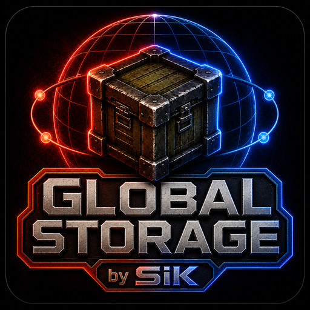
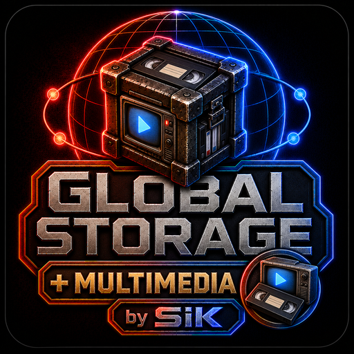

# Global Storage SiK

Global Storage SiK turns the physical containers of a Project Zomboid base into
one searchable, permission-aware network inventory. Define zones, configure
acceptance rules and fill priorities, inspect exact item variants, transfer
physical instances and auto-sort them through an authoritative SP/MP path.

## Products

| Product | Version | Mod ID | Workshop ID | Dependency |
| --- | --- | --- | --- | --- |
| Core | 1.5.2 | GlobalStorageSiK | [3750612158](https://steamcommunity.com/sharedfiles/filedetails/?id=3750612158) | SiKUIFramework |
| Craft | 1.5.2 | GSSiK_Addon_Craft | [3752379654](https://steamcommunity.com/sharedfiles/filedetails/?id=3752379654) | SiKUIFramework, GlobalStorageSiK |
| Builder | 1.5.2 | GSSiK_Addon_Builder | [3752437465](https://steamcommunity.com/sharedfiles/filedetails/?id=3752437465) | SiKUIFramework, GlobalStorageSiK |
| Tablet | 1.5.2 | GSSiK_Addon_Tablet | [3752379947](https://steamcommunity.com/sharedfiles/filedetails/?id=3752379947) | SiKUIFramework, GlobalStorageSiK |
| Multimedia | 0.1.0 | GSSiK_Addon_Multimedia | [3798890105](https://steamcommunity.com/sharedfiles/filedetails/?id=3798890105) | SiKUIFramework, GlobalStorageSiK |

All five target Project Zomboid Build 42.20+ and are maintained. Load
`SiKUIFramework`, then Core, then any official addons. Core supports
singleplayer, hosted games and dedicated multiplayer paths. Project Cook
integration remains optional and requires runtime confirmation in the
installed environment.

## Features

- Unified search, filters and expandable exact-instance details.
- Room, building and hand-drawn zones with rescan and node recovery.
- L1/L2/L3 taxonomy, OR/AND/NOT acceptance rules and deterministic routing.
- Zone/container priority and affinity-aware auto-sort.
- Network ownership, members, permissions, energy and range controls.
- Optional Craft, Builder, Tablet and Multimedia surfaces over the public Core contract.

Install from the official Workshop pages above. Existing containers and their
contents remain physical; follow the in-game terminal requirements to create or
join a network.

Core is the only authority for the public product API:
[API](docs/API.md), [framework boundary](docs/FRAMEWORK.md),
[integration contract](docs/INTEGRATION.md) and
[debugging](docs/DEBUGGING.md). Addons do not define parallel APIs.

Report bugs at [GitHub Issues](https://github.com/Kavalieri/GlobalStorageSiK/issues)
with version, game mode, steps, expected/actual result and relevant
`console.txt` lines without private data. Addon proposals should describe the
public data-driven capability required.

## Español

Global Storage SiK reúne los contenedores físicos de una base en un inventario
de red buscable y con permisos. Permite definir zonas, reglas de aceptación,
prioridades, variantes exactas, transferencias y auto-ordenado mediante rutas
autoritativas para un jugador y multijugador.

Instala `SiKUIFramework`, después `GlobalStorageSiK` y finalmente los addons
que quieras. Los cinco productos requieren Build 42.20+. Project Cook continúa
como integración opcional pendiente de confirmación runtime en cada entorno.

La documentación contractual vive una sola vez en
[API](docs/API.md), [framework](docs/FRAMEWORK.md) e
[integración](docs/INTEGRATION.md). Informa errores en GitHub con versión, modo,
pasos y resultado esperado/real, evitando datos privados.

## ❤️ Support development

Global Storage SiK and its addons are free and will remain free. Voluntary
support is available through [GitHub Sponsors](https://github.com/sponsors/Kavalieri)
and does not unlock features, exclusive content or gameplay advantages.

## ❤️ Apoya el desarrollo

Global Storage SiK y sus addons son gratuitos y seguirán siéndolo. Si quieres
apoyar su desarrollo, pruebas y mantenimiento, puedes hacerlo mediante
[GitHub Sponsors](https://github.com/sponsors/Kavalieri).

El apoyo es completamente voluntario y no desbloquea funciones, contenido ni
ventajas de juego exclusivas.

## Licence and notices

See [LICENSE.md](LICENSE.md), [NOTICE.md](NOTICE.md),
[CONTRIBUTING.md](CONTRIBUTING.md), [SECURITY.md](SECURITY.md),
[MAINTENANCE_STATUS.md](MAINTENANCE_STATUS.md) and
[THIRD_PARTY_NOTICES.md](THIRD_PARTY_NOTICES.md).

This project uses AI assistance, including Codex and Claude, during parts of
design, documentation and development. Product decisions, review and
publication remain with the SiK team.
