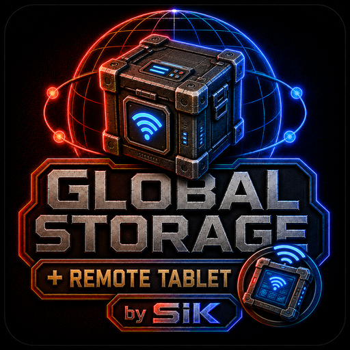

# GSSiK Addon — Tablet 1.5.0

Adds tiered portable access to Global Storage SiK. Accessible networks are
selected through the Core API; membership, installed addon, antenna, range and
terminal availability are revalidated authoritatively.

Mod ID: `GSSiK_Addon_Tablet`. Workshop: [3752379947](https://steamcommunity.com/sharedfiles/filedetails/?id=3752379947).
Requires Project Zomboid 42.20+, `SiKUIFramework` and `GlobalStorageSiK`.
The public contract lives only in [Core Integration](../../docs/INTEGRATION.md).

## Español

Añade acceso portátil por niveles. La API Core selecciona redes accesibles y
revalida de forma autoritativa membresía, addon, antena, alcance y terminal.
